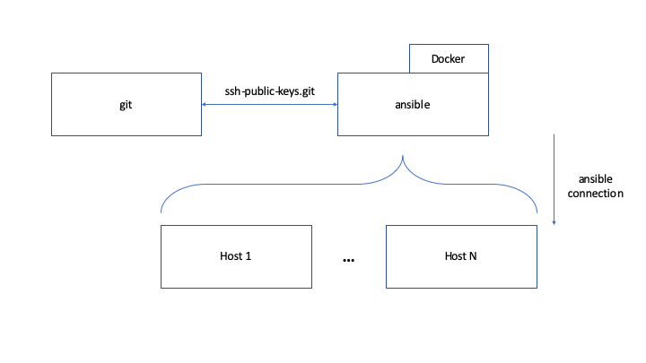

# Vagrant Multi-Machine SSH

## Requirements

Vagrant >=2.2.5

## Diagram



## File Structure

* `Vagrantfile` - description of configuration both VMs
* `pre-install.sh` - script to install all needed dependencies, required for both VMs
* `install-git-server.sh` - script to configure `git` server
* `install-ansible-server.sh` - script to configure `ansible` server
* `ssh/` folder - contains `admin` ssh key, required for exchange of ssh keys

## Run

1. Provision the VMs:
```
vagrant up
```
2. (additionally) Add ssh public keys to ssh-public-key git repository
3. (additionally) Run Docker image with Ansible:
```
docker run --rm -t ansible -v /home/ansible/ssh-public-keys:/home/ansible/.ssh:ro playbook -i hosts.yaml playbook/webserver.yml
```

`(additionally)` - not covered in configuration files

After provisioning of hosts we could check the results:

* ssh key from `ansible` user on `ansible` server was added to `git` server
* git repository with ssh public keys was cloned to `ansible` server
* docker installed on `ansible` server and ready to run

For `git` server:

```
$ vagrant ssh git
$ sudo -u git -i
$ grep ansible ~/.ssh/authorized_keys
ssh-rsa AAAAB3NzaC1yc2EAAAADAQABAAACAQDMMUv/EnlcdOjQCtD29n4PHoNf92Vv2N9pWOjILIBQrM6r0H4VfX8opFDNspboCFOeAN4H4qxHZZlrHYnArmWeIWWAOjsgeG90x1KCa+8+SNA1WA0E5nUeU7NjmGl4FX7eDIIJzv3+X1QLokzIs3NScxgj1+rh7qvJNmxKakyPeViWokzMV3PhnMuJ0MKyFkie2V9QCIDj4Q4FffUWRAmo05f2qTMyYXPhlqtCn0SRGvs27/F4X0UioC2Q8v5K8+onTvmqXJcaoL7VoCYsFWZegrV4vhbli/J1IiMujRF+k0Y4h4ZoKU76sQt4e2Tj6WzZjjm8Z5KlyD/DL3kxzb8HgJ8N5TOBpmD5+7bjixIPTjSXgleI+CZoK0c2og4oXGAOEklK7KibNcOzVlPDNlRE0kLPOX9/qikmplWzyfot9+5UYk41a7IIMeDV8uYpMAjZUP6b9QdxpM7klnFoKXHRUO6mNLutwZYA7nMkfsMeevTLXUC0ZRQ5mCpB1wrUaqjwUhfQTkINO/5wAJ34gy7x9eWAQxnoVFYjPhj8eSrwGzS/0W0pFUfxS1R9f04IpSnAwWFgdIIviiVi7b677lg3a3TDN8ZxyYZneYZ4dr5I92gdkt3u/kJI5/TMWxJbzgarI+qMwFFJ0x6UrecGdG2fc8Xpc+YndnFOzOLdJqeYvQ== ansible
$ ls -l repos/
total 4
drwxr-xr-x 7 git git 4096 Aug 21 19:19 ssh-public-keys.git
```

For `ansible` server:

```
$ vagrant ssh ansible
$ sudo -u ansible -i
$ ls -la ssh-public-keys
total 12
drwxr-xr-x 3 ansible ansible 4096 Aug 21 19:21 .
drwxr-xr-x 4 ansible ansible 4096 Aug 21 19:21 ..
drwxr-xr-x 7 ansible ansible 4096 Aug 21 19:21 .git
$ cd ssh-public-keys
$ git pull # repository is empty, expected behaviour
Your configuration specifies to merge with the ref 'refs/heads/master'
from the remote, but no such ref was fetched.
$ systemctl status docker.service
● docker.service - Docker Application Container Engine
   Loaded: loaded (/lib/systemd/system/docker.service; enabled; vendor preset: enabled)
   Active: active (running) since Wed 2019-08-21 19:21:41 UTC; 3min 57s ago
     Docs: https://docs.docker.com
 Main PID: 4672 (dockerd)
    Tasks: 10
   CGroup: /system.slice/docker.service
           └─4672 /usr/bin/dockerd -H fd:// --containerd=/run/containerd/containerd.sock
```

## Additional information

### Shell scripts

Shell scripts were used as a simple definition of what should be done on the server during provisioning of it on the first setup. Only to demonstrate objective described in task.

```
Provided shell scripts not providing consistency between run. Please destroy host, before provision changes.
```

To achieve consistency between run, additional checks or configuration management (e.g. Ansible) should be used.

Also, all scripts were checked with `shellcheck` to lint the file for any errors.

### Admin SSH key

This key required for key exchange between the hosts, because hosts should know about each other somehow.
